# SentinelFinOps Architecture Guide (v5.0)

This document provides a technical guide to the system design, components, interfaces, deployment patterns, and execution sequences of SentinelFinOps v5.0.

---

## 1. Overall System Architecture

SentinelFinOps is structured as a decoupled, multi-layered system separating AWS resource discovery, cognitive AI reasoning, deterministic policy enforcement, state management, and presenter alerting.

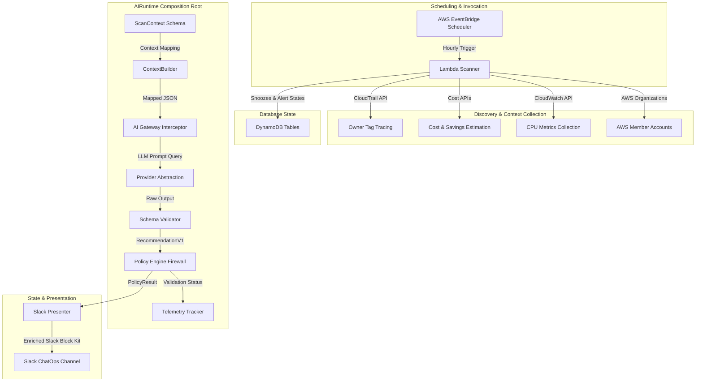

---

## 2. Component Architecture

### Component Diagram

The repository modules are partitioned into scanning, core logic, AI pipelines, policies, and storage:

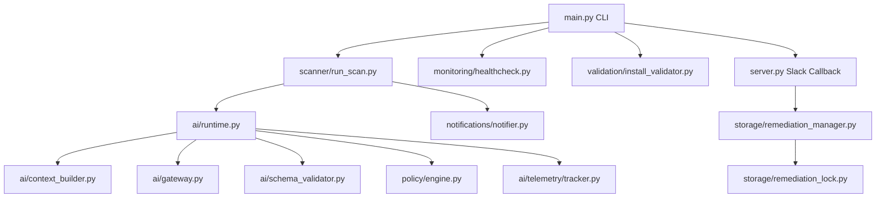

---

## 3. AI Subsystem Architecture

The AI reasoning layer operates as a strict validation pipeline. Raw system context is mapped to immutable contracts, processed by swappable providers, checked by structural validators, and filtered by a policy engine firewall before alerting or executing.

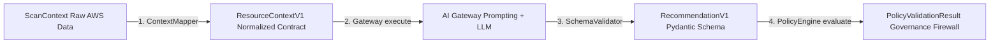

---

## 4. Deployment Architecture

SentinelFinOps is deployed entirely as serverless AWS infrastructure using Terraform, enforcing least-privilege permissions and zero permanent servers.

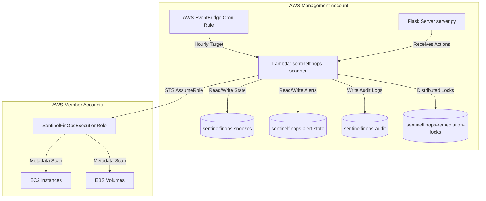

---

## 5. Runtime Sequence Diagram

The following sequence details how a scheduled run is executed, demonstrating how AI execution is optional and falls back gracefully on any pipeline failures:

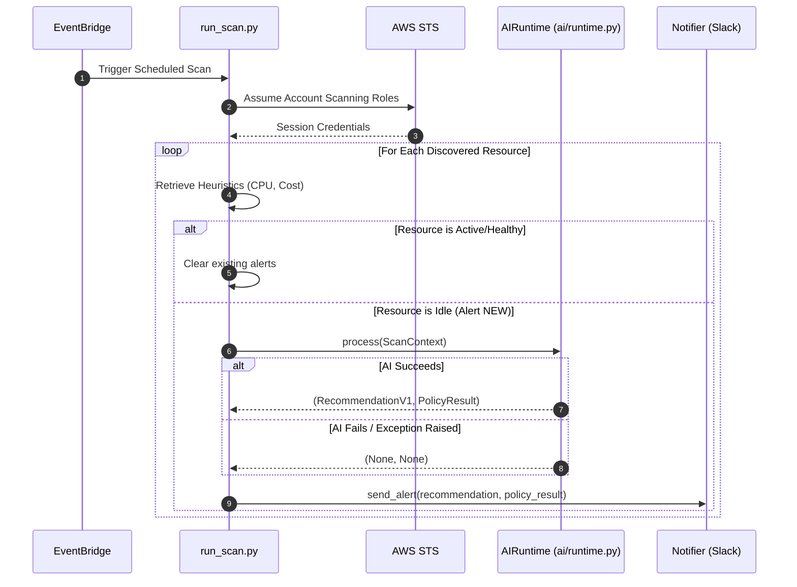

---

## 6. Context Mapping Architecture

Raw discovery inputs are transformed into type-safe, versioned schemas by resource mappers registered inside a MapperRegistry.

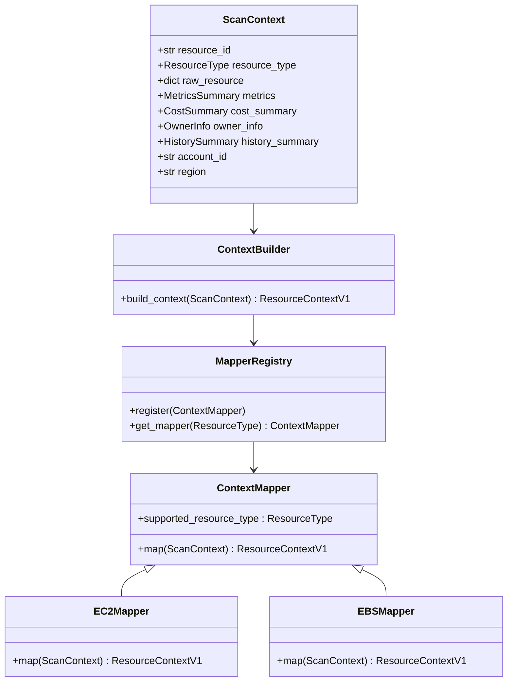

---

## 7. Provider Abstraction

The system interacts with language models through the `LLMProvider` contract, isolating the codebase from changing API clients.

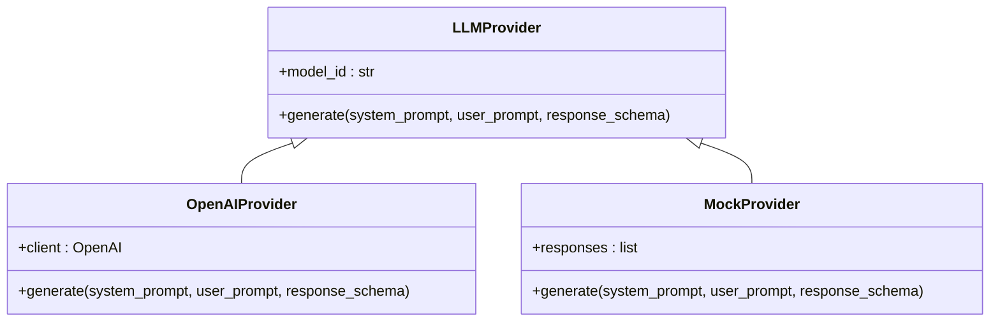

---

## 8. Policy Validation Flow

The Policy Engine acts as a static compliance firewall, evaluating recommendations against deterministic rules. If any rule crashes, it fails closed immediately to protect target infrastructure.

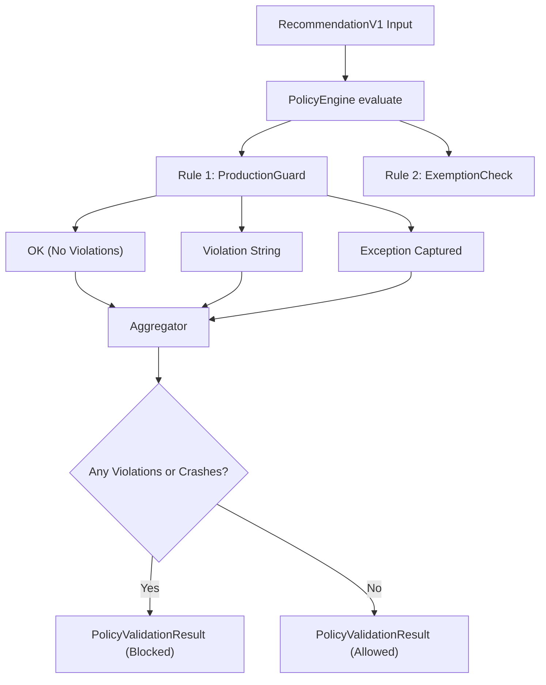

---

## 9. Telemetry Flow

The Telemetry Tracker records request lifecycles passively. It performs defensive copies of internal logs to prevent caller mutation.

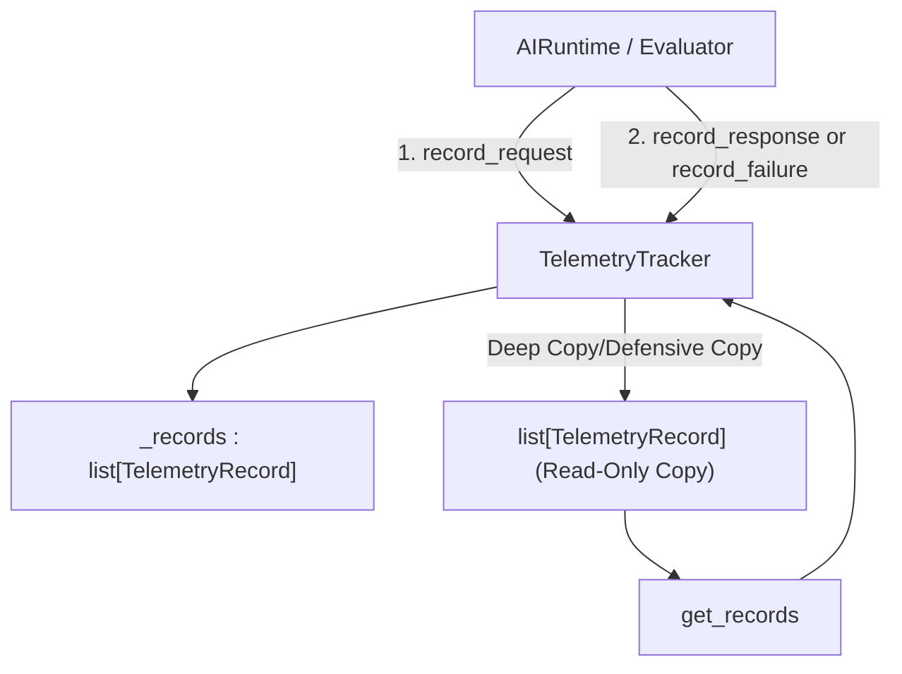

---

## 10. Evaluation Framework

Developers validation runs cases offline sequentially using a mock provider to verify contract compliance, policy results, and pipeline safety.

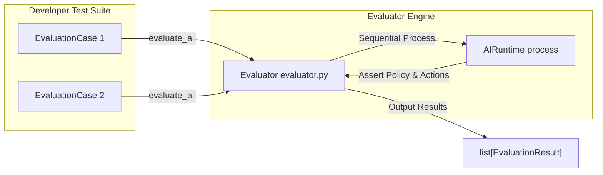

---

## 11. Repository Module Relationships

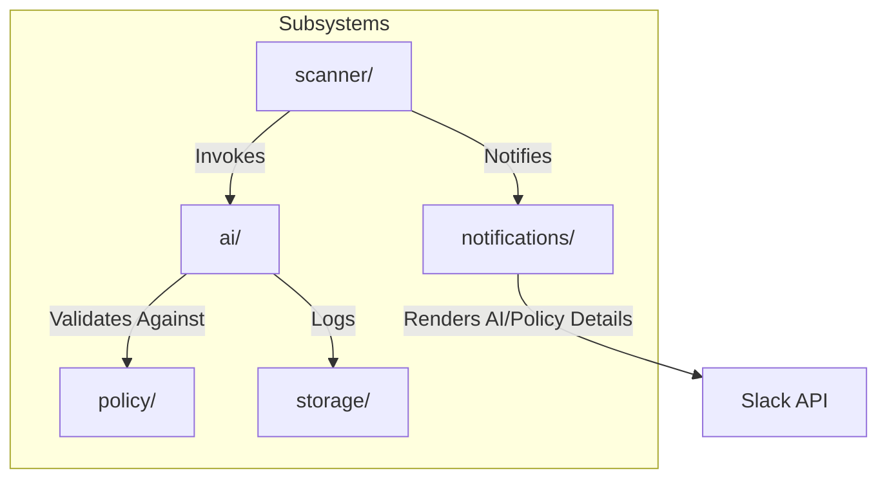

---

## 12. Design Principles & Patterns

1. **Single Source of Truth**: The platform ensures all components use defined configuration objects rather than hardcoded environment mappings.
2. **Fail-Safe Processing**: The AI pipeline resides in an isolated logical compartment. If any runtime exception is thrown (such as OpenAI timeout, Pydantic validation failure, or policy rule check crashes), the execution catches the crash and falls back immediately to legacy scanning heuristics.
3. **Immutability**: Contracts, recommendations, and execution contexts use Pydantic models configured as immutable (or frozen dataclasses) to prevent side-effect bugs.

---

## 13. Dependency Injection Strategy

SentinelFinOps uses constructor dependency injection throughout the AI runtime layer to isolate dependency building from execution logic:
- `AIRuntime` receives `ContextBuilder`, `AIGateway`, `SchemaValidator`, `PolicyEngine`, and `TelemetryTracker` via its constructor.
- Dependency instantiation resides in a single **Composition Root** factory function: `create_ai_runtime()`.
- This ensures `AIRuntime` can be tested easily by injecting mock objects, avoiding system registry state conflicts.

---

## 14. Extension Guide

### How to Add a New Provider
1. Inherit from `LLMProvider` in `ai/interfaces/provider.py`.
2. Implement the `generate` signature.
3. Register the new client implementation in the composition root `create_ai_runtime()` inside `ai/runtime.py`.

### How to Add a New Policy Rule
1. Inherit from `PolicyRule` in `policy/rules/base_rule.py`.
2. Implement `evaluate(self, recommendation: RecommendationV1, context: Any = None)`.
3. If validation fails, return a list of string violations. If it passes, return `True`.
4. Register the rule instance in the `create_ai_runtime` composition root's policy engine ruleset in `ai/runtime.py`.

### How to Add a New Prompt Template
1. Create a subdirectory under `config/prompts/` matching the prompt name.
2. Inside that directory, create a semantic version subdirectory (e.g. `1.1.0/`).
3. Add `system.txt` and `user.txt` templates. The `PromptRegistry` will automatically discover and sort the new templates.
