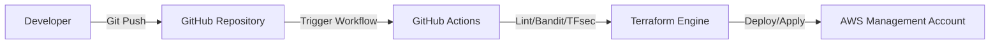
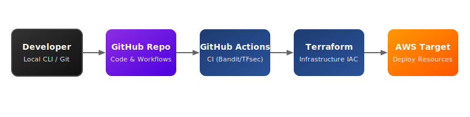
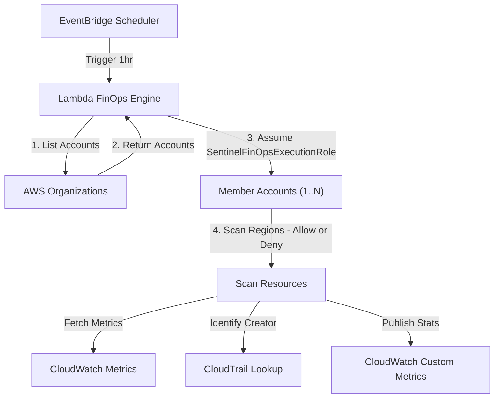
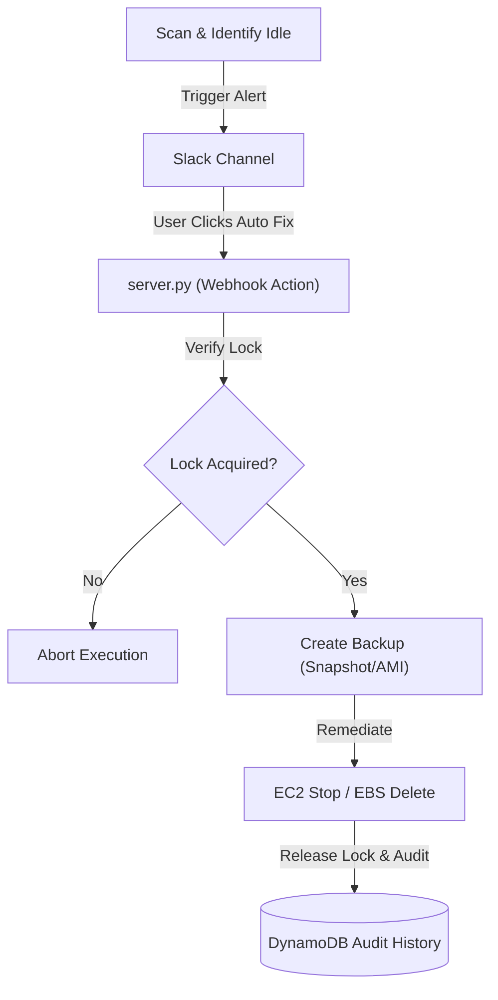
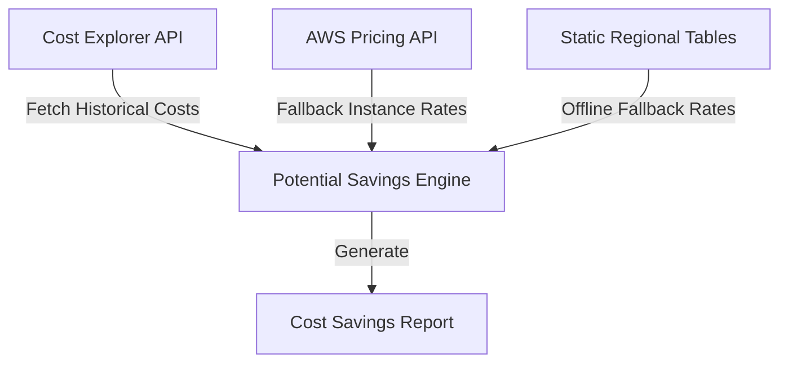
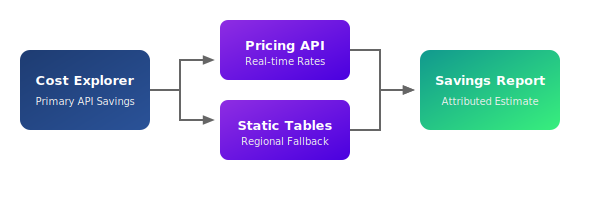
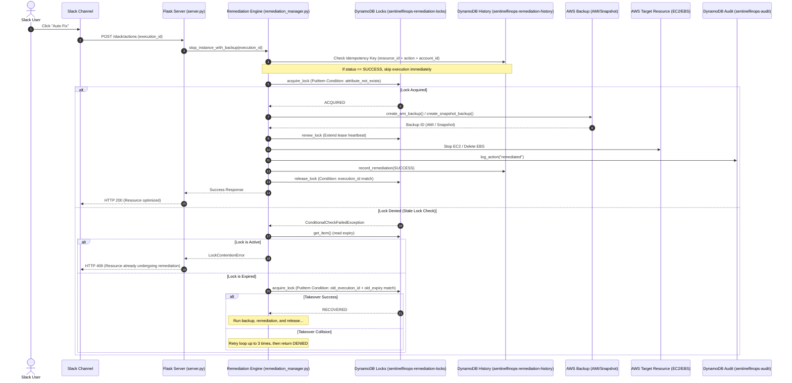

# SentinelFinOps Architecture Documentation

This document describes the enterprise-grade technical architecture, component design, data flows, and security model of the SentinelFinOps v4.5 platform.

---

## Technical Architecture Overview

SentinelFinOps is structured into five core layers:
1. **Infrastructure & Registry Layer**: Discovers AWS accounts via AWS Organizations and scans multiple enabled regions for EC2 instances and EBS volumes.
2. **Metrics & Decision Engine**: Evaluates average CPU usage and capacity parameters against configurations.
3. **Audit & Identity Resolution Layer**: Tracks resource creators using CloudTrail events, logging actions to DynamoDB.
4. **ChatOps & Alerting Layer**: Dispatches detailed notifications to Slack with action keys (Acknowledge, Snooze, Auto Fix).
5. **State & Remediation Layer**: Manages multi-account execution locks, time-based suppressions, and backup processes (snapshots/AMIs) prior to stopping or deleting idle assets.

---

## System Diagrams

### 1. Deployment Architecture
Describes the CI/CD pipeline and infrastructure provisioning path.

---

### 2. Runtime Architecture
Illustrates the hourly scanner execution flow across the AWS Organization structure.

---

### 3. Remediation Lifecycle Flow
Shows the end-to-end flow from detection to auditable auto-fixing.

---

### 4. Savings Calculation Flow
Maps how the platform estimates waste values using real-time and fallback static resources.

---

## Architectural Decisions & Tradeoffs

### 1. DynamoDB State Management
* **Decision**: All suppression rules, remediation locks, audit history, and execution states are persisted in AWS DynamoDB tables.
* **Tradeoff**: Offers serverless, low-latency scaling that enables cross-account execution and prevents race conditions, but incurs minimal AWS data-store charges compared to flat file solutions.

### 2. AWS Organizations Role Assumption
* **Decision**: We utilize Boto3 assume role with target role configurations rather than registering individual member accounts manually.
* **Tradeoff**: Greatly reduces onboarding overhead (bootstrap command creates roles automatically), but requires administrative privilege (`OrganizationAccountAccessRole`) during onboarding.

### 3. Non-Pinging Installation Validation
* **Decision**: The setup validator verifies webhook connectivity by running HTTP HEAD checks to the domain root (`https://hooks.slack.com`) instead of pushing a test alert.
* **Tradeoff**: Eliminates notifications during deployment/CI cycles while ensuring egress proxying and DNS resolution are fully functional.

---

## Security Model

1. **Least Privilege Execution Roles**: The `SentinelFinOpsExecutionRole` is granted read-only metadata permissions for scanning, and tight, resource-specific write permissions (`ec2:StopInstances`, `ec2:DeleteVolume`, `ec2:CreateSnapshot`, `ec2:CreateImage`) for remediation.
2. **Management Account Safety**: Remediation is automatically skipped if the target resource resides in the AWS Organization Management Account.
3. **Environment Security**: Sensitive keys and credentials are bound to environment variables or injected securely via Terraform configurations and the gitignored `config/settings.yaml`.

---

## Distributed Coordination (v4.6)

### Remediation Concurrency & Idempotency Sequence

The diagram below details how SentinelFinOps ensures that concurrent webhook calls (e.g. from multiple Slack button clicks) or overlapping Lambda scans do not trigger duplicate resource remediations or duplicate backups.

### Core Coordination Architecture

#### 1. Why DynamoDB Conditional Writes?
AWS DynamoDB supports atomic operations using `ConditionExpression` attributes. When acquiring a lock, SentinelFinOps attempts a conditional put verifying that the key `resource_id` does not exist:
`ConditionExpression="attribute_not_exists(resource_id)"`
If the record exists, the API atomically rejects the write with a `ConditionalCheckFailedException`, ensuring that exactly one execution thread claims the resource lock.

#### 2. Why not threading.Lock or in-memory locking?
In-memory locks (e.g. `threading.Lock`) only protect concurrent threads executing inside a single OS process container. SentinelFinOps is deployed in serverless, ephemeral environments (AWS Lambda invocations or distributed Flask application workers). An external, distributed locking provider (DynamoDB) is required to coordinate transactions across distinct compute contexts.

#### 3. Stale Lock Recovery
If an execution host crashes, terminates due to a Lambda timeout, or loses network connectivity mid-remediation, the lock is left in the database.
* To prevent permanent deadlocks, locks are written with an `expires_at` ISO timestamp.
* Subsequent attempts that receive a check failure read the lock row. If `expires_at` is in the past, they attempt an optimistic conditional write matching:
  `ConditionExpression="execution_id = :old_exec AND expires_at = :old_exp"`
* On success, the stale lease is safely overtaken (status `"RECOVERED"`). On collision (e.g. another concurrent run won the takeover), the worker retries up to 3 times before giving up.

#### 4. Decoupled Idempotency
Locks guarantee concurrency control (preventing overlapping runs). Idempotency guarantees once-per-resource safety (preventing repeated execution after completion).
* Remediations check the history index database using a composite key: `resource_id + action + account_id`.
* Even if locks expire or are released, the presence of a `SUCCESS` record with a matching idempotency key forces the remediation pipeline to return immediately without duplicate backup or stop/delete API calls.

