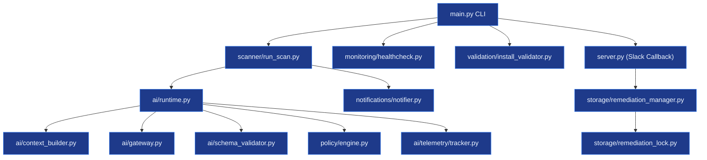
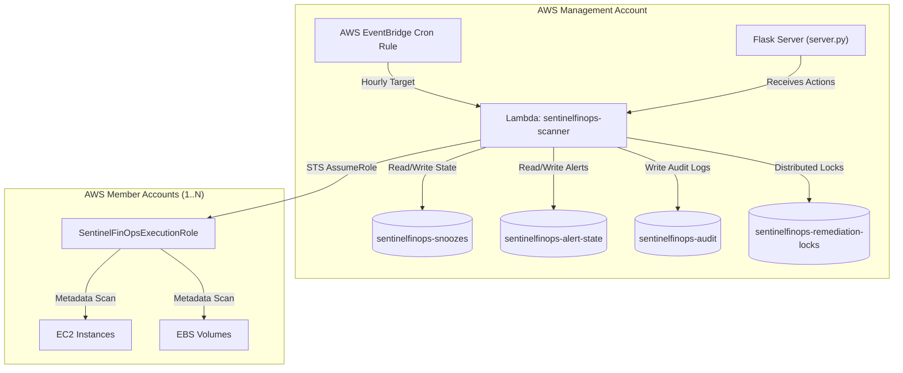
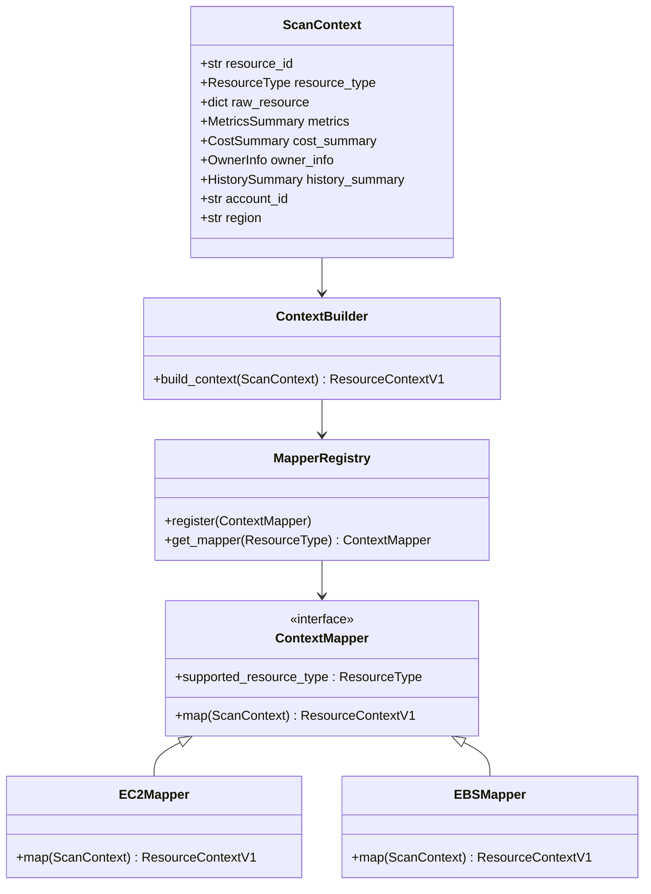
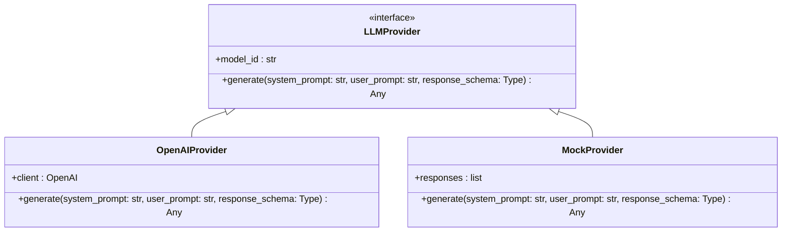
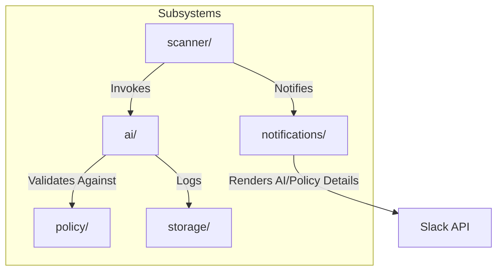

# SentinelFinOps Architecture Guide (v5.0)

This document provides a technical guide to the system design, components, interfaces, deployment patterns, and execution sequences of SentinelFinOps v5.0.

---

## 1. Overall System Architecture

SentinelFinOps is structured as a decoupled, multi-layered system separating AWS resource discovery, cognitive AI reasoning, deterministic policy enforcement, state management, and presenter alerting.

```mermaid
graph TB
    subgraph Scheduling & Invocation
        Scheduler["AWS EventBridge Scheduler"] -->|Hourly Trigger| Lambda["Lambda Scanner (scanner/run_scan.py)"]
    end

    subgraph Discovery & Context Collection
        Lambda -->|AWS Organizations| MemberAcc["AWS Member Accounts"]
        Lambda -->|CloudWatch API| CW["CPU Metrics Collection"]
        Lambda -->|Cost APIs| Cost["Cost & Savings Estimation"]
        Lambda -->|CloudTrail API| CT["Owner Tag Tracing"]
    end

    subgraph AIRuntime (Composition Root)
        ScanCtx["ScanContext Schema"] -->|Context Mapping| ContextBuilder["ContextBuilder"]
        ContextBuilder -->|Mapped JSON| AIGateway["AI Gateway Interceptor"]
        AIGateway -->|LLM Prompt Query| Provider["Provider Abstraction (OpenAI)"]
        Provider -->|Raw Output| SchemaValidator["Schema Validator"]
        SchemaValidator -->|RecommendationV1| PolicyEngine["Policy Engine Firewall"]
        PolicyEngine -->|Validation Status| TelemetryTracker["Telemetry Tracker (In-Memory)"]
    end

    subgraph State & presenter
        PolicyEngine -->|PolicyResult| Slack["Slack presenter (notifier.py)"]
        Slack -->|Enriched Slack Block Kit| UserChannel["Slack ChatOps Channel"]
    end

    subgraph Database State
        Lambda -->|Snoozes & Alert States| DDB["DynamoDB Tables"]
    end
```

---

## 2. Component Architecture

### Component Diagram

The repository modules are partitioned into scanning, core logic, AI pipelines, policies, and storage:



---

## 3. AI Subsystem Architecture

The AI reasoning layer operates as a strict validation pipeline. Raw system context is mapped to immutable contracts, processed by swappable providers, checked by structural validators, and filtered by a policy engine firewall before alerting or executing.

```mermaid
graph LR
    ScanContext["ScanContext (Raw AWS Data)"]
    ResourceContext["ResourceContextV1 (Normalized Contract)"]
    Gateway["AI Gateway (Prompting + LLM)"]
    Recommendation["RecommendationV1 (Pydantic Schema)"]
    PolicyResult["PolicyValidationResult (Governance Firewall)"]

    ScanContext -->|1. ContextMapper| ResourceContext
    ResourceContext -->|2. Gateway execute| Gateway
    Gateway -->|3. SchemaValidator| Recommendation
    Recommendation -->|4. PolicyEngine evaluate| PolicyResult
```



---

## 4. Deployment Architecture

SentinelFinOps is deployed entirely as serverless AWS infrastructure using Terraform, enforcing least-privilege permissions and zero permanent servers.



---

## 5. Runtime Sequence Diagram

The following sequence details how a scheduled run is executed, demonstrating how AI execution is optional and falls back gracefully on any pipeline failures:

```mermaid
sequenceDiagram
    autonumber
    participant Event as EventBridge
    participant Scanner as run_scan.py
    participant STS as AWS STS
    participant AIRuntime as AIRuntime (ai/runtime.py)
    participant Slack as Notifier (Slack)

    Event->>Scanner: Trigger Scheduled Scan
    Scanner->>STS: Assume Account Scanning Roles
    STS-->>Scanner: Session Credentials

    loop For Each Discovered Resource
        Scanner->>Scanner: Retrieve Heuristics (CPU, Cost)
        alt Resource is Active/Healthy
            Scanner->>Scanner: Clear existing alerts
        else Resource is Idle (Alert NEW)
            Note over Scanner, AIRuntime: Optional AI Pipeline Execution
            rect rgb(30, 30, 40)
                Scanner->>AIRuntime: process(ScanContext)
                alt AI Succeeds
                    AIRuntime-->>Scanner: (RecommendationV1, PolicyResult)
                else AI Fails / Exception Raised
                    AIRuntime-->>Scanner: (None, None)
                end
            end
            Scanner->>Slack: send_alert(recommendation, policy_result)
            Note over Scanner, Slack: Renders rich details if present, falls back to legacy if None
        end
    end
```



---

## 6. Context Mapping Architecture

Raw discovery inputs are transformed into type-safe, versioned schemas by resource mappers registered inside a MapperRegistry.



---

## 7. Provider Abstraction

The system interacts with language models through the `LLMProvider` contract, isolating the codebase from changing API clients.



---

## 8. Policy Validation Flow

The Policy Engine acts as a static compliance firewall, evaluating recommendations against deterministic rules. If any rule crashes, it fails closed immediately to protect target infrastructure.

```mermaid
graph TD
    Rec["RecommendationV1 Input"] --> Engine["PolicyEngine.evaluate()"]
    Engine -->|Iterate Rules| Rule1["Rule 1: ProductionGuard"]
    Engine -->|Iterate Rules| Rule2["Rule 2: ExemptionCheck"]

    Rule1 -->|Passes| R1_Ok["OK (No Violations)"]
    Rule1 -->|Fails| R1_Fail["Violation String"]
    Rule1 -->|Crashes| R1_Crash["Exception Captured"]

    R1_Ok & R1_Fail & R1_Crash --> Aggregator["Aggregator"]
    
    alt Any Violations or Crashes Present
        Aggregator -->|Status: FAILED| ResultFail["PolicyValidationResult (Blocked)"]
    else All Rules Passed
        Aggregator -->|Status: PASSED| ResultPass["PolicyValidationResult (Allowed)"]
    end
```

---

## 9. Telemetry Flow

The Telemetry Tracker records request lifecycles passively. It performs defensive copies of internal logs to prevent caller mutation.

```mermaid
graph TD
    Caller["AIRuntime / Evaluator"] -->|1. record_request()| Tracker["TelemetryTracker"]
    Caller -->|2. record_response() OR record_failure()| Tracker
    
    Tracker -->|Append Record| InternalList["_records : list[TelemetryRecord]"]
    
    UserQuery["get_records()"] --> Tracker
    Tracker -->|Deep Copy/Defensive Copy| CopiedList["list[TelemetryRecord] (Read-Only Copy)"]
    CopiedList --> UserQuery
```

---

## 10. Evaluation Framework

Developers validation runs cases offline sequentially using a mock provider to verify contract compliance, policy results, and pipeline safety.

```mermaid
graph LR
    subgraph Developer Test Suite
        Case1["EvaluationCase 1"]
        Case2["EvaluationCase 2"]
    end

    subgraph Evaluator Engine
        Evaluator["Evaluator (ai/eval/evaluator.py)"]
        AIRuntime["AIRuntime.process()"]
    end

    Case1 & Case2 -->|evaluate_all()| Evaluator
    Evaluator -->|Sequential Process| AIRuntime
    AIRuntime -->|Assert Policy & Actions| Evaluator
    Evaluator -->|Output Results| ResultList["list[EvaluationResult]"]
```

---

## 11. Repository Module Relationships



---

## 12. Design Principles & Patterns

1. **Single Source of Truth**: The platform ensures all components use defined configuration objects rather than hardcoded environment mappings.
2. **Fail-Safe Processing**: The AI pipeline resides in an isolated logical compartment. If any runtime exception is thrown (such as OpenAI timeout, Pydantic validation failure, or policy rule check crashes), the execution catches the crash and falls back immediately to legacy scanning heuristics.
3. **Immutability**: Contracts, recommendations, and execution contexts use Pydantic models configured as immutable (or frozen dataclasses) to prevent side-effect bugs.

---

## 13. Dependency Injection Strategy

SentinelFinOps uses constructor dependency injection throughout the AI runtime layer to isolate dependency building from execution logic:
- `AIRuntime` receives `ContextBuilder`, `AIGateway`, `SchemaValidator`, `PolicyEngine`, and `TelemetryTracker` via its constructor.
- Dependency instantiation resides in a single **Composition Root** factory function: `create_ai_runtime()`.
- This ensures `AIRuntime` can be tested easily by injecting mock objects, avoiding system registry state conflicts.

---

## 14. Extension Guide

### How to Add a New Provider
1. Inherit from `LLMProvider` in `ai/interfaces/provider.py`.
2. Implement the `generate` signature.
3. Register the new client implementation in the composition root `create_ai_runtime()` inside `ai/runtime.py`.

### How to Add a New Policy Rule
1. Inherit from `PolicyRule` in `policy/rules/base_rule.py`.
2. Implement `evaluate(self, recommendation: RecommendationV1, context: Any = None)`.
3. Add the rule to the instantiation array of `PolicyEngine` inside `create_ai_runtime()`.

### How to Add a New Prompt Template
1. Create a subdirectory under `config/prompts/` matching the prompt name.
2. Inside that directory, create a semantic version subdirectory (e.g. `1.1.0/`).
3. Add `system.txt` and `user.txt` templates. The `PromptRegistry` will automatically discover and sort the new templates.
