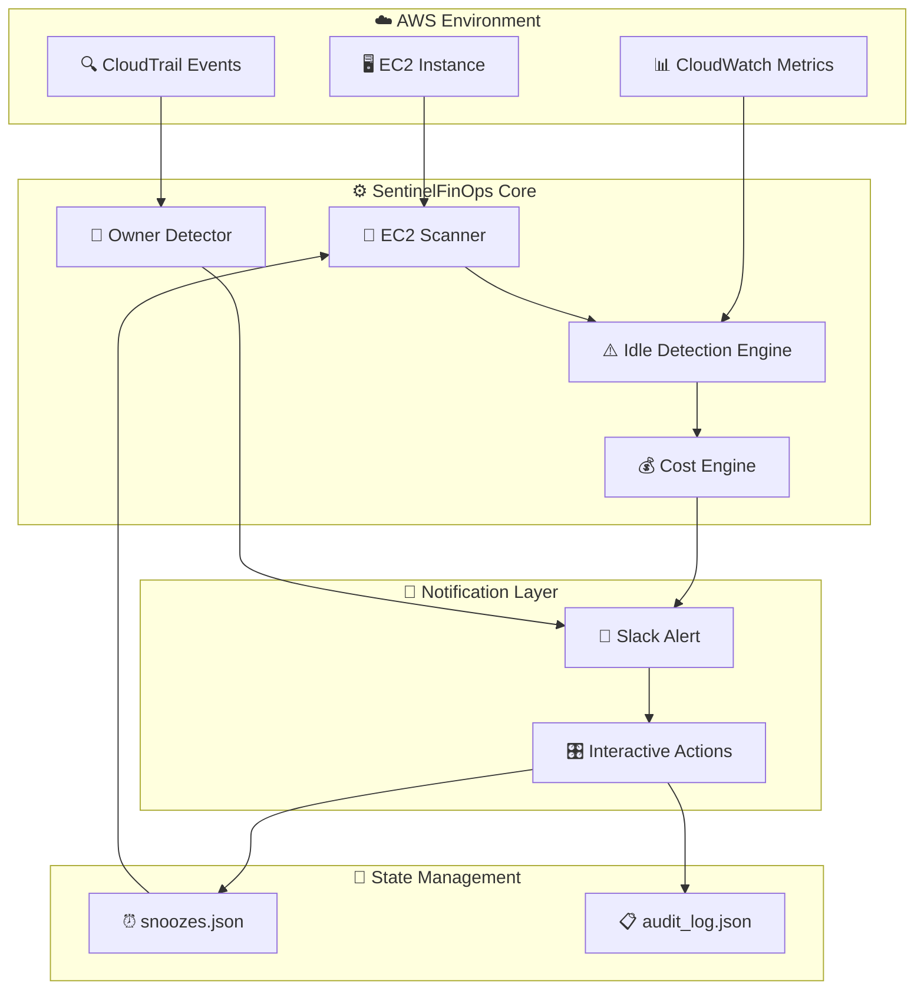
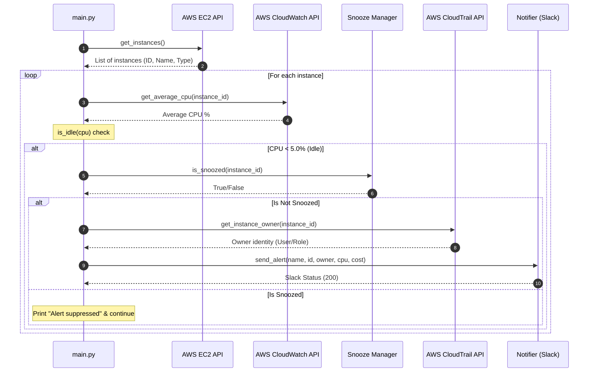
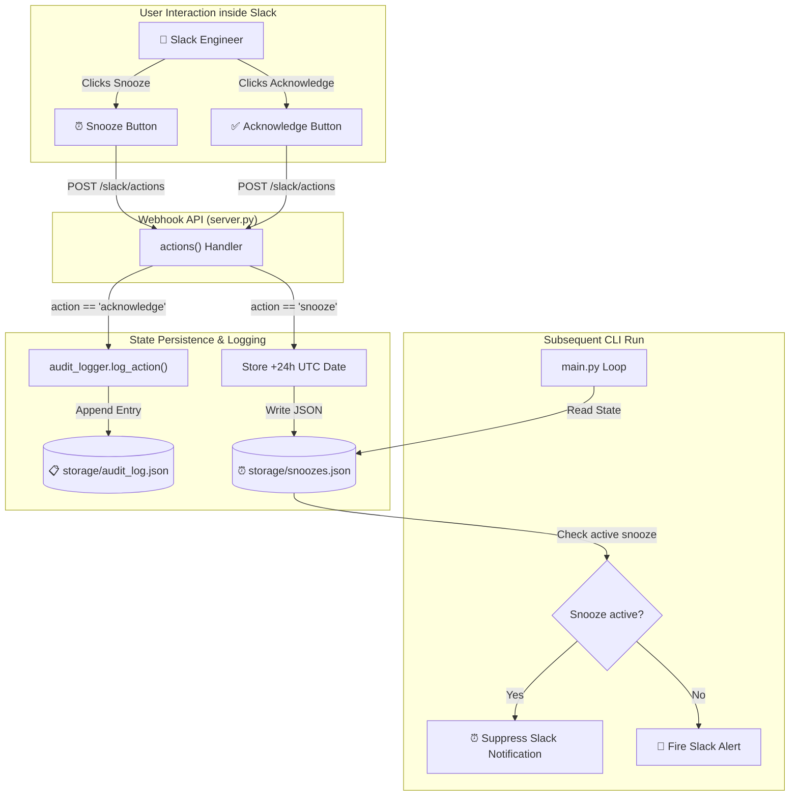
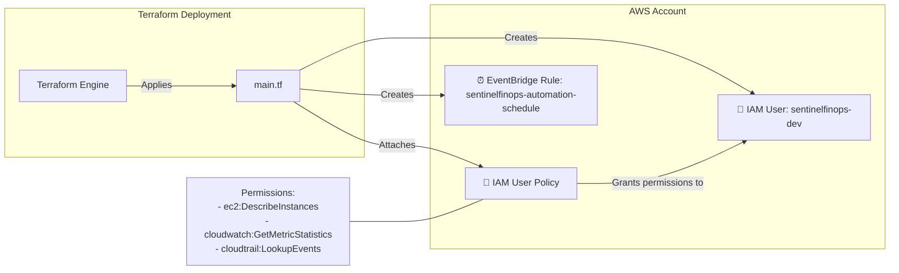
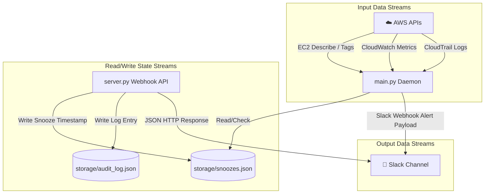

# SentinelFinOps Architecture Documentation

This document describes the technical architecture, component design, data flows, design decisions, and security model of the SentinelFinOps platform.

---

## Technical Architecture Overview

SentinelFinOps is divided into five core layers:
1. **Infrastructure & Registry Layer**: Queries AWS EC2 API for active compute state.
2. **Metrics & Decision Engine**: Evaluates metrics against governance rules (CPU threshold, hourly pricing).
3. **Audit & Identity Resolution Layer**: Leverages CloudTrail event history to trace resource ownership.
4. **ChatOps API Layer**: Distributes alerts and listens for actions via a webhook responder.
5. **State & Auditing Subsystem**: Manages timezone-aware alert suppression and keeps logs of team actions.

---

## Component Breakdown

### 1. EC2 Scanner
* **Responsibilities**: Connects to the AWS EC2 client using Boto3 to discover active virtual machines and extract operational tags.
* **Inputs**: AWS Client Credentials, Region configuration.
* **Outputs**: A structured list of dictionaries containing `instance_id`, `instance_type`, and `instance_name` (parsed from the `Name` tag, defaulting to `"Unknown"`).

### 2. CloudWatch Scanner
* **Responsibilities**: Retrieves average metric data for identified instances over a specified observation window.
* **Inputs**: `instance_id`, start and end times (1-hour window).
* **Outputs**: Average CPU utilization float.

### 3. Idle Detection Engine
* **Responsibilities**: Evaluates computed resource utilization averages against a configurable threshold to identify wasteful instances.
* **Threshold Logic**: `average_cpu < 5.0%` registers the instance state as `IDLE`.

### 4. Cost Engine
* **Responsibilities**: Maps instance types to on-demand hourly pricing models and calculates potential savings.
* **Pricing Logic**: Multiplies the hourly pricing rate by 24 hours * 30 days to project the monthly waste value.

### 5. CloudTrail Owner Detector
* **Responsibilities**: Queries CloudTrail history using the resource ID to find who launched the instance.
* **Owner Resolution**: Evaluates the `RunInstances` event, parsing the `userIdentity` structure to extract the exact IAM User Name or Assumed Role Issuer Name.
* **Fallback Behavior**: Gracefully catches access errors or missing trails, returning `"Unknown"` to prevent execution halts.

### 6. Slack Notification Service
* **Responsibilities**: Constructs Slack Block Kit messages containing resource metadata, owner info, estimated waste, and interactive action buttons.
* **Alert Generation**: Sends POST payloads to the configured Slack Webhook URL.

### 7. Snooze Manager
* **Responsibilities**: Validates alert suppression states.
* **Persistence**: Reads and checks against `storage/snoozes.json`.
* **Expiration Checking**: Computes current UTC time against the recorded ISO date. If the recorded time is in the future, the alert is suppressed.

### 8. Audit Logger
* **Responsibilities**: Appends structured governance logs to `storage/audit_log.json`.
* **Action History**: Records the instance ID, action type (e.g. `acknowledged`), and a UTC timestamp for compliance reviews.

---

## Architecture Diagrams

### 1. High-Level Architecture

---

### 2. Execution Sequence Diagram

---

### 3. Interactive Action Flow

---

### 4. Terraform Infrastructure Diagram

---

### 5. Data Flow Diagram

---

## Architectural Decisions & Tradeoffs

### 1. Lightweight JSON File Storage
* **Decision**: Chose local JSON files (`snoozes.json` and `audit_log.json`) over database deployment (e.g. SQLite, PostgreSQL, or DynamoDB).
* **Tradeoff**: 
  * *Pros*: Simple, zero operational cost, zero maintenance overhead, easy to review and backup.
  * *Cons*: Single-host constraint. Multiple executors running in parallel would hit write locks. For larger scale deployments, this state layer must be moved to DynamoDB.

### 2. Live CloudTrail Ownership Tracing
* **Decision**: Resolved creator identities dynamically from CloudTrail events instead of requiring mandatory tags at instance launch.
* **Tradeoff**:
  * *Pros*: Works on legacy resources that lack tagging hygiene, enforcing immediate accountability.
  * *Cons*: CloudTrail event searches (`LookupEvents`) can be slow and are subject to API rate throttling.

### 3. Slack-First Remediation (ChatOps)
* **Decision**: Used interactive Slack alerts instead of building a web dashboard.
* **Tradeoff**:
  * *Pros*: Shorter feedback loop. Developers are more likely to respond to a message in Slack than log into a separate dashboard.
  * *Cons*: High reliance on third-party API availability and public webhook endpoints.

### 4. Terraform Bootstrap Modularity
* **Decision**: Provisioned only the foundation credentials (IAM User, Policy, EventBridge Scheduler placeholder) rather than packaging the app into AWS Lambda.
* **Tradeoff**:
  * *Pros*: Demonstrates secure, declarative IAM management, keeping the system clean and validate-able via `terraform plan` without introducing complex Lambda zipping steps.
  * *Cons*: Execution still requires a host to run the python script daemon.

---

## Security Considerations

1. **Least Privilege IAM Policy**: The Terraform-provided IAM policy restricts access to only read metadata (`ec2:DescribeInstances`), query metrics (`cloudwatch:GetMetricStatistics`), and check CloudTrail logs (`cloudtrail:LookupEvents`). It has no mutate/write permissions.
2. **Environment Variable Hygiene**: Critical values like `SLACK_WEBHOOK_URL` and AWS credentials are loaded dynamically from environment variables, preventing hardcoded credentials from leaking to source repositories.
3. **Gitignore Protection**: `.env`, `.ENV`, and virtual environments (`venv/`) are explicitly excluded from tracking in `.gitignore`.
4. **Webhook Security**: The Slack webhook endpoints do not accept write payloads that modify infrastructure; they only permit updating alert suppression states and auditing logging.

---

## Limitations

* **Single Region Execution**: The scanner runs against the configured AWS provider region only. Cross-region scanning requires extending the scanner logic.
* **Pricing Cache Naivety**: The Cost Engine maps a static price list lookup. It does not query the AWS Price List API dynamically, meaning it does not reflect local region pricing fluctuations or savings plans.
* **Local Webhook Expiry**: Local testing using Ngrok utilizes public tunnels which expire on free accounts, requiring updating the Slack app request URL periodically.
