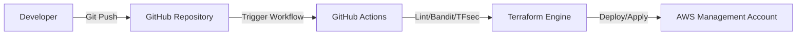
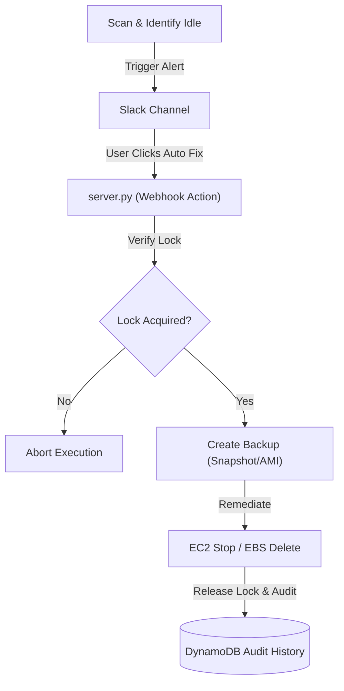
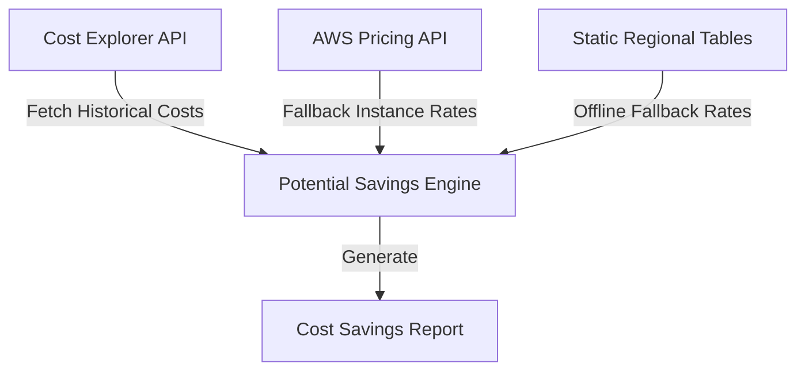

# SentinelFinOps Architecture Documentation

This document describes the enterprise-grade technical architecture, component design, data flows, and security model of the SentinelFinOps v4.5 platform.

---

## Technical Architecture Overview

SentinelFinOps is structured into five core layers:
1. **Infrastructure & Registry Layer**: Discovers AWS accounts via AWS Organizations and scans multiple enabled regions for EC2 instances and EBS volumes.
2. **Metrics & Decision Engine**: Evaluates average CPU usage and capacity parameters against configurations.
3. **Audit & Identity Resolution Layer**: Tracks resource creators using CloudTrail events, logging actions to DynamoDB.
4. **ChatOps & Alerting Layer**: Dispatches detailed notifications to Slack with action keys (Acknowledge, Snooze, Auto Fix).
5. **State & Remediation Layer**: Manages multi-account execution locks, time-based suppressions, and backup processes (snapshots/AMIs) prior to stopping or deleting idle assets.

---

## System Diagrams

### 1. Deployment Architecture
Describes the CI/CD pipeline and infrastructure provisioning path.




---

### 2. Runtime Architecture
Illustrates the hourly scanner execution flow across the AWS Organization structure.

```mermaid
graph TD
    EventBridge["EventBridge Scheduler"] -->|Trigger (1hr)| Lambda["Lambda FinOps Engine"]
    Lambda -->|1. List Accounts| Org["AWS Organizations"]
    Org -->|2. Return Accounts| Lambda
    Lambda -->|3. Assume SentinelFinOpsExecutionRole| Member["Member Accounts (1..N)"]
    Member -->|4. Scan Regions (Allow/Deny)| Scan["Scan Resources"]
    Scan -->|Fetch Metrics| CW["CloudWatch Metrics"]
    Scan -->|Identify Creator| CT["CloudTrail Lookup"]
    Scan -->|Publish Stats| CW_Metrics["CloudWatch Custom Metrics"]
```


---

### 3. Remediation Lifecycle Flow
Shows the end-to-end flow from detection to auditable auto-fixing.




---

### 4. Savings Calculation Flow
Maps how the platform estimates waste values using real-time and fallback static resources.




---

## Architectural Decisions & Tradeoffs

### 1. DynamoDB State Management
* **Decision**: All suppression rules, remediation locks, audit history, and execution states are persisted in AWS DynamoDB tables.
* **Tradeoff**: Offers serverless, low-latency scaling that enables cross-account execution and prevents race conditions, but incurs minimal AWS data-store charges compared to flat file solutions.

### 2. AWS Organizations Role Assumption
* **Decision**: We utilize Boto3 assume role with target role configurations rather than registering individual member accounts manually.
* **Tradeoff**: Greatly reduces onboarding overhead (bootstrap command creates roles automatically), but requires administrative privilege (`OrganizationAccountAccessRole`) during onboarding.

### 3. Non-Pinging Installation Validation
* **Decision**: The setup validator verifies webhook connectivity by running HTTP HEAD checks to the domain root (`https://hooks.slack.com`) instead of pushing a test alert.
* **Tradeoff**: Eliminates notifications during deployment/CI cycles while ensuring egress proxying and DNS resolution are fully functional.

---

## Security Model

1. **Least Privilege Execution Roles**: The `SentinelFinOpsExecutionRole` is granted read-only metadata permissions for scanning, and tight, resource-specific write permissions (`ec2:StopInstances`, `ec2:DeleteVolume`, `ec2:CreateSnapshot`, `ec2:CreateImage`) for remediation.
2. **Management Account Safety**: Remediation is automatically skipped if the target resource resides in the AWS Organization Management Account.
3. **Environment Security**: Sensitive keys and credentials are bound to environment variables or injected securely via Terraform configurations and the gitignored `config/settings.yaml`.
