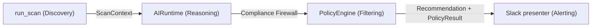
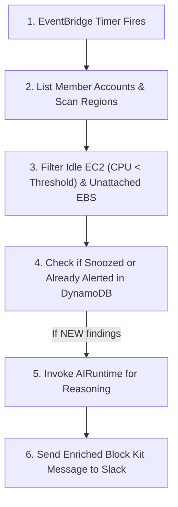
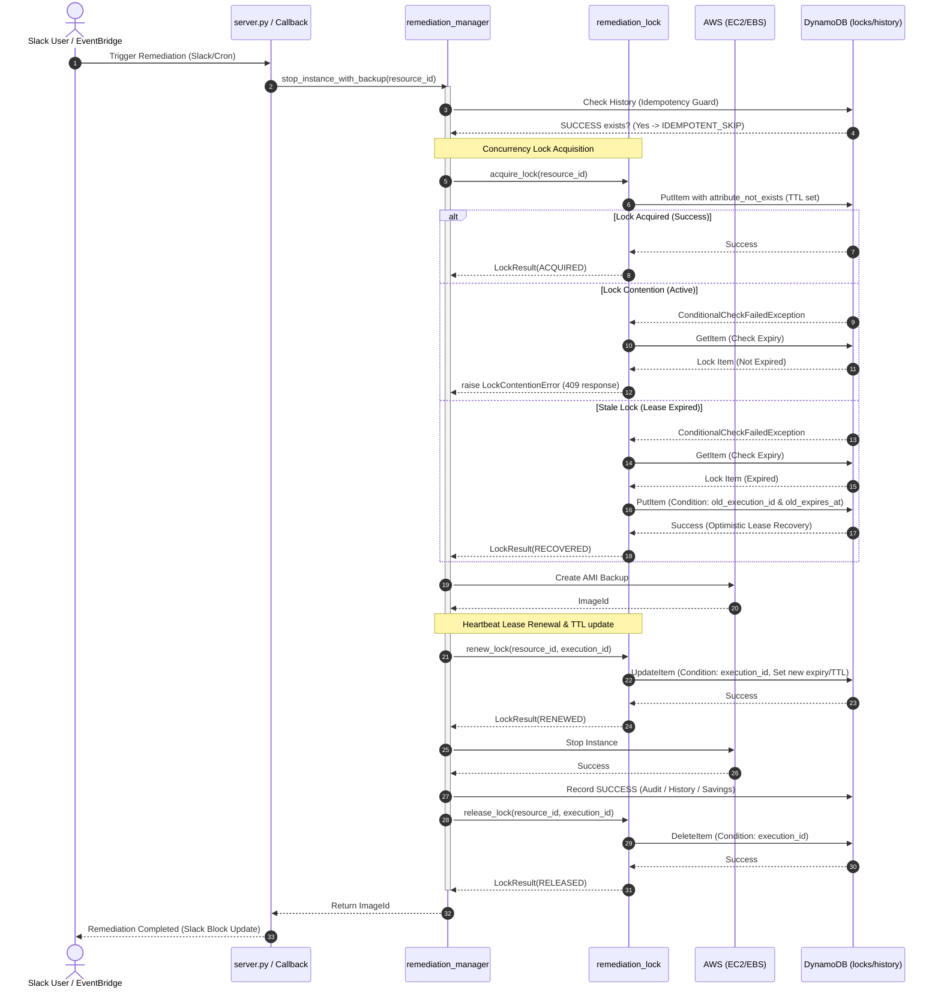

# SentinelFinOps (v5.0)

[](https://github.com/VaishnavSreekumar/sentinelfinops/actions/workflows/ci.yml)
[](SECURITY.md)
[](LICENSE)
[](https://www.python.org/)
[](https://www.terraform.io/)

---

## 1. What is SentinelFinOps?

SentinelFinOps is an open-source cloud financial operations (FinOps) automation platform designed to scan, analyze, and optimize cloud infrastructure costs. It automatically identifies underutilized, idle, or orphaned cloud assets (such as idle EC2 virtual machines and unattached EBS storage volumes) across multiple cloud accounts and regions. Once discovered, the platform evaluates optimization actions, validates them against business policy guardrails, and presents interactive, one-click remediation alerts to infrastructure teams directly via Slack.

---

## 2. Why Does It Exist?

### The Cloud Cost Problem
As organizations migrate to the cloud, resource provision sprawl grows. Without continuous automated tracking, development, staging, and orphaned backup environments are left running permanently, accumulating high on-demand pricing charges.

### Idle Infrastructure
Many virtual instances are provisioned larger than necessary or left running over weekends and holidays. Additionally, when virtual machines are terminated, their storage volumes (EBS) are frequently left unattached, accumulating cost indefinitely.

### AI-Assisted Governance
Traditional cost scanners rely on simple static heuristics (e.g., CPU < 5% = delete) which often trigger false positives. SentinelFinOps integrates cognitive AI reasoning to analyze complex utilization trends, cost structures, and owner behaviors, providing highly detailed action recommendations. To prevent AI hallucinations or unintended resource destructions, these recommendations are audited by a deterministic compliance firewall before interacting with any resource.

---

## 3. Key Features

### Cloud Governance
- **Multi-Account Account Scanning**: Automatically scans AWS member accounts using Organizations API discovery.
- **Multi-Region Operations**: Custom region allowlist/denylist filter parameters to ignore disaster recovery or restricted zones.
- **Tag-Based Exclusion Safeguards**: Exclude critical resources using tag boundaries (e.g., `SentinelFinOps=Ignore`).

### AI Governance
- **Structured Optimization Suggestions**: Cognitive reasoning generates type-safe, validated optimization recommendations.
- **Interchangeable Providers**: Pluggable support for OpenAI models and customizable local mock interfaces.
- **Versioned Prompt Files**: System and user prompt templates are version-controlled, avoiding hardcoded instruction drifts.

### Safety & Guardrails
- **Deterministic Policy Firewall**: A compliance policy engine verifies recommendations before alert dispatch.
- **Fail-Safe Processing**: The AI pipeline operates as a non-intrusive enhancement. If the model or API fails, scanning falls back instantly to standard heuristics.
- **Remediation Lock Coordination**: Ephemeral and concurrent fixing operations are synchronized using DynamoDB conditional locks to prevent double-fixing race conditions.
- **Automatic Backups**: Performs AMIs and EBS snapshots prior to stopping or deleting target resources.

### Telemetry & Auditing
- **Auditable Ledger Logs**: Records all execution states, savings metrics, and user Slack actions in DynamoDB.
- **Metric Collection**: Tracks model latency, token counts, cache statistics, and validation states.

### Developer Experience
- **Pre-deployment Verification**: Commands to validate target IAM, Organizations, DynamoDB, Lambda, and Slack routing.
- **Self-Testing Suite**: Validates local connectivity and credentials without spamming Slack alerts.
- **Offline Evaluation Suite**: Developer tool to verify pipeline behavior and expectations using sequential cases.

---

## 4. Architecture Overview

At a high level, SentinelFinOps operates in a closed loop. The scheduled runner discovers AWS resource metadata. It packages the raw parameters into a normalized `ScanContext` and passes it to the `AIRuntime`. The runtime translates this data into a schema-validated prompt context, fetches suggestions from the configured language model, and checks them against compliance policies. Validated recommendations are dispatched to Slack as interactive Block Kit cards, where engineers can approve, snooze, or reject them.



---

## 5. Quick Start

Follow these steps to deploy and run SentinelFinOps in your local sandbox:

### Step 1: Clone the Repository
```bash
git clone https://github.com/VaishnavSreekumar/sentinelfinops.git
cd sentinelfinops
```

### Step 2: Set Up Virtual Environment & Dependencies
Ensure Python 3.11+ is installed:
```bash
# Initialize venv
python -m venv venv

# Hack to activate venv
# On macOS/Linux:
source venv/bin/activate
# On Windows:
.\venv\Scripts\activate

# Install requirements
pip install -r requirements.txt
```

### Step 3: Configure Settings
Copy the settings template:
```bash
cp config/settings.example.yaml config/settings.yaml
```
Open `config/settings.yaml` and configure the following parameters:
- `aws.default_region`: The AWS region where DynamoDB tables will be deployed (e.g., `ap-south-1`).
- `slack.webhook_url`: Your Slack incoming webhook URL (create one at api.slack.com).

Ensure your terminal has active AWS credentials (`aws sts get-caller-identity`).

### Step 4: Deploy Foundations via Terraform
Install the Terraform CLI, then deploy DynamoDB tables, EventBridge rules, and IAM execution roles:
```bash
cd terraform
terraform init
terraform apply -auto-approve
cd ..
```

### Step 5: Run Installation Validation
Verify that DynamoDB tables, AWS permissions, and Slack channels are configured correctly:
```bash
python main.py validate
```

### Step 6: Execute a Local Scan
Trigger a manual scan to inspect your EC2 and EBS resources:
```bash
python main.py scan
```

---

## 6. Configuration

Configuration parameters are loaded from YAML, environment overrides, and the local prompt directories:

- **YAML Configuration (`config/settings.yaml`)**:
  - `aws`: AWS Organizations, scanning regions, and cross-account assumed role naming.
  - `slack`: Incoming webhook endpoints and notification routing parameters.
  - `finops`: CPU utilization threshold parameters (default: `5.0%`) and cost Explorer flags.
  - `ai`: Configures providers (e.g., `openai`), target models (`gpt-4o`), and prompt file storage paths.
- **Environment Variables**:
  - `OPENAI_API_KEY`: Authentication key for the OpenAI provider.
  - `SLACK_WEBHOOK_URL`: Overrides configured Slack endpoint.
  - `AWS_REGION`: Overrides default regional targets.
- **Prompt Registry (`config/prompts/`)**:
  - Contains versioned folders (e.g., `cost_optimizer/1.0.0/`) holding `system.txt` and `user.txt`.

---

## 7. Execution Flow

When a scheduled scan runs, the system performs the following actions:



---

## 8. The AI Pipeline

When the `AIRuntime` processes a resource, it executes the following sequence:

1. **Context Builder**: Combines raw resource specifications, CPU averages, pricing data, ownership tags, and historical states into a normalized `ResourceContextV1` Pydantic model.
2. **AI Gateway**: Loads the prompt templates from the registry, serializes the context model, and sends the payload to the provider.
3. **Provider**: Connects to the LLM client (e.g., OpenAI API) to complete structured completions.
4. **Schema Validator**: Enforces schema validation constraints on the parsed `RecommendationV1` model returned by the provider.
5. **Policy Engine**: Passes the recommendation to deterministic compliance checks. If any policy fails or crashes, the recommendation is blocked.
6. **Telemetry**: Logs model latency, token usage, validation statuses, and errors to the database.
7. **Slack Formatting**: Compiles the final alert block containing recommendation details and policy violations.

### 8.1. AI Provider Selection & Offline Development

The platform supports multiple AI providers through Provider Abstraction. You can switch between providers using the `OPENAI_PROVIDER` environment variable (or the `ai.provider` configuration in `settings.yaml`):

#### Running with MockProvider (Offline/Testing)
To run the scanner using the local, deterministic provider without requiring internet access or OpenAI credits:
```bash
# Windows PowerShell
$env:OPENAI_PROVIDER="mock"
python main.py scan
```
When active, the CLI prints:
`AI Provider: MockProvider`

#### Running with OpenAIProvider (Production)
To run the scanner using the live OpenAI API:
```bash
# Windows PowerShell
$env:OPENAI_PROVIDER="openai"
$env:OPENAI_API_KEY="your-api-key"
python main.py scan
```
When active, the CLI prints:
`AI Provider: OpenAIProvider`

#### Design Rationale & Best Practices
* **Reproducibility**: In automated operations, we must guarantee that a specific AWS resource state consistently yields the same recommendation during testing.
* **Offline Local Development**: Enables developers to construct, modify, and test the entire discovery-reasoning-governance loop locally without hitting API rate limits or incurring OpenAI credit costs.
* **CI Integration**: Allows continuous integration pipelines to execute the complete AI runtime, policy firewall, and telemetry subsystem under simulated workloads without needing live network endpoints or API secrets.

---

## 9. Repository Structure

Understanding the layout:

- `ai/`: Houses the AI reasoning subsystem.
  - `contracts/`: Type-safe schema contracts (recommendations, contexts, policy outcomes).
  - `interfaces/`: Abstraction layers for providers, gateways, and registries.
  - `providers/`: Swappable LLM provider implementations.
  - `telemetry/`: Log recorders tracking latency and token usage.
  - `eval/`: Sequential developer offline validation framework.
- `policy/`: Governance firewall package containing static compliance rules (e.g., `ProductionGuardRule`).
- `config/`: Configuration settings and prompts template registry.
- `scanner/`: Core AWS Boto3 client discovery modules (EC2, EBS, CloudWatch, and owner detector).
- `storage/`: Database handlers managing snoozes, alert states, and distributed remediation locks.
- `terraform/`: Deployable infrastructure configurations.
- `validation/`: Installation self-test validation engines.

---

## 10. Diagram Examples

### Overall System Architecture
Review our complete hardware, routing, and logic layers in the System Diagram section of [ARCHITECTURE.md](ARCHITECTURE.md#1-overall-system-architecture).

### Remediation Concurrency Control
Review the concurrency locking sequence describing how DynamoDB prevents concurrent double-remediation actions in [ARCHITECTURE.md](ARCHITECTURE.md#11-distributed-coordination-v46).

Below is the execution flow of locking safety:



---

## 11. Roadmap

SentinelFinOps v5.0 completes our architectural objectives:

- [x] Phase 0: Repository Prep
- [x] Phase 1: Canonical AI Contracts
- [x] Phase 2: Context Mapping
- [x] Phase 3: Provider Abstraction
- [x] Phase 4: OpenAI Provider
- [x] Phase 5: Prompt Registry
- [x] Phase 6: AI Gateway
- [x] Phase 7: Schema Validator
- [x] Phase 8: Telemetry
- [x] Phase 9: Policy Engine Compliance Firewall
- [x] Phase 10: Slack presenter
- [x] Phase 11: Runtime Integration
- [x] Phase 12: Offline AI Evaluation Framework
- [x] Phase 13: Documentation & Hardening

SentinelFinOps v5.0 is fully complete, hardened, and ready for enterprise-grade open-source deployments.
