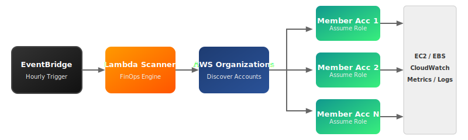
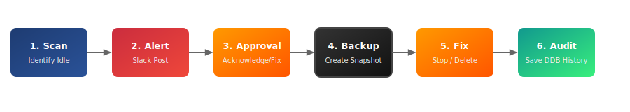

# SentinelFinOps

[](https://github.com/VaishnavSreekumar/sentinelfinops/actions/workflows/ci.yml)
[](https://github.com/VaishnavSreekumar/sentinelfinops/SECURITY.md)
[](LICENSE)
[](https://www.python.org/)
[](https://www.terraform.io/)

SentinelFinOps is an enterprise-grade cloud governance and FinOps automation platform that discovers idle, underutilized, and orphaned AWS EC2/EBS resources across multiple accounts and regions in an AWS Organization, alerts their owners via interactive Slack ChatOps, enforces guardrails, and manages auditable cost remediation.

---

## Quick Start

Get SentinelFinOps up and running in your environment in minutes:

```bash
# 1. Clone the repository
git clone https://github.com/VaishnavSreekumar/sentinelfinops.git
cd sentinelfinops

# 2. Setup a virtual environment & install pinned dependencies
python -m venv venv
source venv/bin/activate  # On Windows: .\venv\Scripts\activate
pip install -r requirements.txt

# 3. Create your live configuration file from template
cp config/settings.example.yaml config/settings.yaml

# 4. Initialize and apply Terraform to deploy foundations (DynamoDB, IAM, Lambda, Schedules)
cd terraform
terraform init
terraform apply
cd ..

# 5. Validate your installation parameters and IAM roles
python main.py validate

# 6. Check runtime health parameters and connectivity
python main.py health
```

---

## Core System Architecture

SentinelFinOps supports scheduled multi-account scans via cross-account IAM role assumption. Below are the key system architectures:

### 1. Runtime Scanning Architecture
EventBridge triggers the Lambda Scanner, which discovers AWS member accounts and assumes the execution role in each to analyze resources.


### 2. Remediation Lifecycle Flow
Alerts are sent to Slack. Engineers click buttons to snooze, acknowledge, or trigger automated remediation with safety locks and backups.


For complete architectural details, see [ARCHITECTURE.md](ARCHITECTURE.md).

---

## Key Features

- **AWS Organizations Support**: Automatically discovers active member accounts and assumes pre-provisioned IAM execution roles.
- **Multi-Region & Allow/Deny Listing**: Scans all active AWS regions with custom allow/deny configuration parameters to exclude DR or GovCloud environments.
- **Stateful Remediation Locks**: Employs DynamoDB-based distributed locking with automatic 15-minute expirations to prevent race conditions during concurrent fixing actions.
- **Enterprise Configuration Ingestion**: Standardized YAML ingestion using PyYAML with validation rules checking `config_version: 1`.
- **Egress & Health Validation**: Built-in self-test tools to verify database tables, lambda environments, event rules, and connection check reachability of Slack without triggering duplicate notification spam.
- **Automatic Backups**: Creates EC2 AMIs and EBS Snapshots before performing any automated termination or stop action.

---

## Project Structure

```text
sentinelfinops/
 ├── .github/workflows/      # GitHub Action CI/CD pipelines (ci.yml & release.yml)
 ├── ai/                     # Centralized AI reasoning package (v5.0 placeholders)
 │    ├── contracts/         # Versioned contract API schemas (resource context, recommendations)
 │    ├── interfaces/        # Core system abstraction layers (provider base client)
 │    ├── providers/         # Swappable model integrations (Bedrock, OpenAI, Anthropic, Ollama)
 │    ├── telemetry/         # Logs, metrics, and diagnostics
 │    └── eval/              # Evaluation verification system
 ├── policy/                 # Governance firewall package
 │    └── rules/             # Static governance rules (e.g. production guards)
 ├── bootstrap/              # Automation tools for cross-account role boarding
 │    └── bootstrap_accounts.py
 ├── config/                 # YAML configuration settings & templates
 │    ├── settings.yaml      # User live configurations (gitignored)
 │    └── settings.example.yaml
 ├── docs/                   # Runbooks, documentation & architecture visuals
 │    ├── images/            # Exported SVG vector diagrams
 │    └── RUNBOOK.md         # Troubleshooting and incident response
 ├── engine/                 # Core analysis & heuristics engines
 │    ├── idle_engine.py
 │    └── cost_engine.py
 ├── monitoring/             # Health checking & CloudWatch metrics
 │    ├── healthcheck.py
 │    └── metrics.py
 ├── notifications/          # Alerting integration (Slack Block Kit)
 │    └── notifier.py
 ├── scanner/                # Boto3 client scans & CloudTrail owner tracing
 │    ├── ec2_scanner.py
 │    ├── ebs_scanner.py
 │    └── owner_detector.py
 ├── storage/                # Database state clients
 │    └── alert_state_manager.py
 ├── templates/              # Git version-controlled prompt templates
 │    └── cost_optimizer/
 ├── validation/             # Self-check validate suite
 │    └── install_validator.py
 ├── tests/                  # Unittest suite
 ├── terraform/              # Infrastructure code (IAM, DynamoDB, Lambda, EventBridge)
 ├── requirements.txt        # Pinned project dependencies
 ├── version.py              # Single source of truth version file
 ├── main.py                 # CLI entrypoint
 └── server.py               # Slack webhook callback server
```

## Distributed Locking & Concurrency Control (v4.6)

SentinelFinOps implements a distributed locking layer to coordinate auto-remediation actions safely across:
* EPHEMERAL contexts (multiple AWS Lambda cron runs)
* DISTRIBUTED processes (Flask callback workers in server.py)
* Multiple users clicking "Auto Fix" concurrently in Slack.

### Why Duplicate Remediation is Dangerous
Without proper synchronization:
1. **Redundant Backups**: Simultaneous clicks start multiple AMIs or snapshots of the same resource, inflating EBS costs.
2. **API Exceptions**: A second thread attempts to stop/delete an already stopped/deleted resource, raising errors.
3. **Ledger Pollution**: Audit logs and savings records get written to multiple times.

### How SentinelFinOps Solves This
1. **Atomic Conditional Writes**: Acquiring a lock attempts a DynamoDB PutItem requiring `attribute_not_exists(resource_id)`.
2. **Optimistic Lease Takeover**: Expired locks are recovered by validating that the previous owner (`execution_id`) and expiration time match when overwritten.
3. **Decoupled Idempotency**: Prior to checking locks, the pipeline checks the history. If a SUCCESS state is logged for that `resource_id + action + account_id`, it skips execution immediately.
4. **heartbeat Lease Renewal**: The lease is extended atomically right after successful backup creation (protecting against long backup latency).

### Locking & Remediation Sequence Flow

```mermaid
sequenceDiagram
    autonumber
    actor User as Slack User / EventBridge
    participant S as server.py / Callback
    participant M as remediation_manager
    participant L as remediation_lock
    participant AWS as AWS (EC2/EBS)
    participant DDB as DynamoDB (locks/history)

    User->>S: Trigger Remediation (Slack/Cron)
    S->>M: stop_instance_with_backup(resource_id)
    activate M
    M->>DDB: Check History (Idempotency Guard)
    DDB-->>M: SUCCESS exists? (Yes -> IDEMPOTENT_SKIP)
    
    rect rgb(30, 30, 40)
        Note over M, L: Concurrency Lock Acquisition
        M->>L: acquire_lock(resource_id)
        L->>DDB: PutItem with attribute_not_exists (TTL set)
        alt Lock Acquired (Success)
            DDB-->>L: Success
            L-->>M: LockResult(ACQUIRED)
        else Lock Contention (Active)
            DDB-->>L: ConditionalCheckFailedException
            L->>DDB: GetItem (Check Expiry)
            DDB-->>L: Lock Item (Not Expired)
            L-->>M: raise LockContentionError (409 response)
        else Stale Lock (Lease Expired)
            DDB-->>L: ConditionalCheckFailedException
            L->>DDB: GetItem (Check Expiry)
            DDB-->>L: Lock Item (Expired)
            L->>DDB: PutItem (Condition: old_execution_id & old_expires_at)
            DDB-->>L: Success (Optimistic Lease Recovery)
            L-->>M: LockResult(RECOVERED)
        end
    end

    M->>AWS: Create AMI Backup
    AWS-->>M: ImageId
    
    Note over M, L: Heartbeat Lease Renewal & TTL update
    M->>L: renew_lock(resource_id, execution_id)
    L->>DDB: UpdateItem (Condition: execution_id, Set new expiry/TTL)
    DDB-->>L: Success
    L-->>M: LockResult(RENEWED)

    M->>AWS: Stop Instance
    AWS-->>M: Success

    M->>DDB: Record SUCCESS (Audit / History / Savings)
    
    M->>L: release_lock(resource_id, execution_id)
    L->>DDB: DeleteItem (Condition: execution_id)
    DDB-->>L: Success
    L-->>M: LockResult(RELEASED)
    
    deactivate M
    M-->>S: Return ImageId
    S-->>User: Remediation Completed (Slack Block Update)
```



---

## AI Governance Architecture Evolution (v5.0 Road Map)

SentinelFinOps v5.0 evolves the platform into an AI-powered cloud optimization system utilizing cognitive reasoning bounded by a deterministic policy engine firewall:

* **Canonical Contracts**: Translates raw resources into standardized, version-controlled `ResourceContextV1` schemas.
* **AI Gateway**: Transparent interceptor management supporting cost tracking, response caching, and provider failover.
* **Swappable Providers**: Pluggable integration client connectors supporting AWS Bedrock, OpenAI, Anthropic, and Ollama.
* **Schema Validator**: Enforces schema correctness on structural outputs before execution.
* **Deterministic Policy Engine**: Intercepts recommendations to enforce static compliance policies (like safety locks and tags).

For more details on the evolution blueprint, see the [sentinelfinops_v5.0_rfc.md](file:///C:/Users/vaish/.gemini/antigravity-ide/brain/9d5fd9a5-638c-483a-85a5-ec417c54b78c/sentinelfinops_v5.0_rfc.md).

---

## Open Source Compliance

Contributions are welcome! Please check [CONTRIBUTING.md](CONTRIBUTING.md) for style requirements, testing policies, and branch naming conventions. Refer to [SECURITY.md](SECURITY.md) to report vulnerabilities.

Licensed under the [Apache License, Version 2.0](LICENSE).
